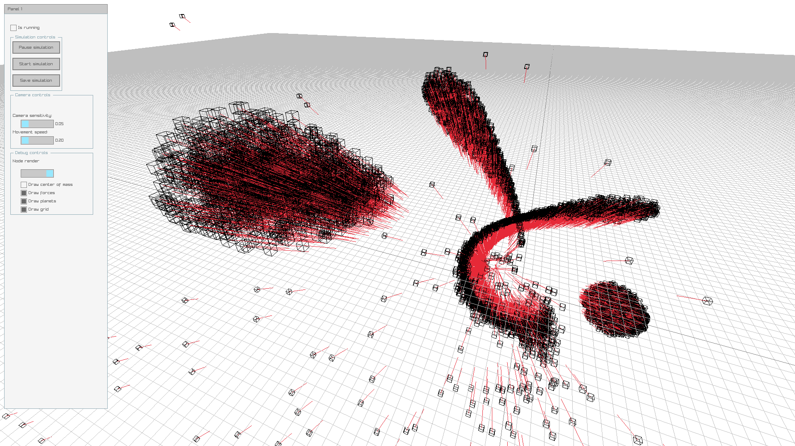

# N body simulation
This is a simple N body simulation using the Barnes-Hut algorithm. The simulation is written in C++ and uses the [RayLib](https://www.raylib.com/) library for rendering and [glaze](https://github.com/stephenberry/glaze) for serialization.


## Building
To build the simulation, you need to have [conan](https://conan.io/) & [CMake](https://cmake.org/) installed. Then, you can run the following commands:

skip this if you already have configured conan before 
```bash 
conan profile detect
```
then run
```bash
conan install . --output-folder=build --build=missing
```
If you encounter problems use without `--parallel` flag
```bash
mkdir build
cd build
cmake -DCMAKE_CXX_FLAGS="${CMAKE_CXX_FLAGS} -O3 -ffast-math -march=native" ..
cmake --build . --config Release --parallel
```
```bash
./n-body-simulation
```
Enjoy the simulation!